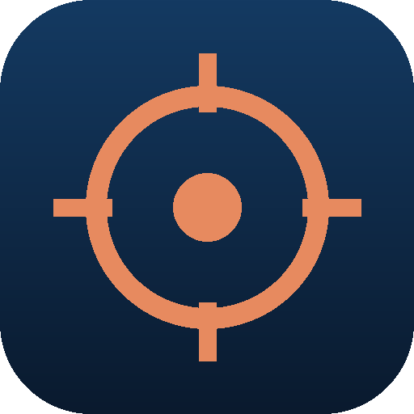

<p align="center">
  
</p>

<h1 align="center">Prowl</h1>

<p align="center">
  <b>Vaka for people who break things for a living.</b><br>
  The same protection engine as Vaka, tuned for security researchers and bug bounty hunters. Dark by default.
</p>

<p align="center">
  <a href="https://github.com/northcrafto/prowl-dl/releases/latest"></a>
  <a href="https://github.com/northcrafto/prowl-dl/releases"></a>
  <a href="LICENSE"></a>
  
</p>

<p align="center">
  <a href="https://vaka-web-lovat.vercel.app/prowl-win"><b>Download for Windows</b></a> ·
  <a href="https://vaka-web-lovat.vercel.app/prowl-linux"><b>Linux</b></a>
</p>

---

## What Prowl is

Prowl shares its whole codebase with [Vaka](https://github.com/vaka-browser/vaka), the safe Swedish browser. Everything Vaka does for families, Prowl does for hackers: the same Brave ad-blocking engine, the same zero-knowledge wallet and password manager, the same Krypto sidebar. On top of that comes a workflow built around bug bounty work.

- **Hacker start page** with shortcuts to HackerOne, Intigriti, Immunefi, TryHackMe and your own targets.
- **Krypto in "brain" modes** — recon, web, mobile, reporting — with its own system prompt for security work.
- **Network panel** that shows every request the page makes, with filtering, headers and bodies.
- **Dark theme** everywhere, from the shell to the settings.
- **Brave's adblock-rust engine** built in, so the noise is gone while you look at what matters.

## Build from source

You need Node.js 22 or newer.

```bash
git clone https://github.com/vaka-browser/prowl.git
cd prowl
npm install
npm start
```

`npm install` downloads the castLabs build of Electron. The ad-blocking engine's native binaries are vendored in `native/adblock/` for Linux, Windows and macOS, so no Rust toolchain is needed. Packaging works exactly as in [Vaka's README](https://github.com/vaka-browser/vaka#packaging).

## Contributing

Bug reports, filter fixes and code are welcome. The rules are the same as for Vaka: read [CONTRIBUTING.md](CONTRIBUTING.md) and [CODE_OF_CONDUCT.md](CODE_OF_CONDUCT.md). Security problems go through the **Security** tab, never a public issue — see [SECURITY.md](SECURITY.md).

Prowl is a tool for authorised testing. Use it on systems you own or have written permission to test.

## License

[Mozilla Public License 2.0](LICENSE). Filter lists and Electron keep their own licenses.

<p align="center">Made in Sweden.</p>
